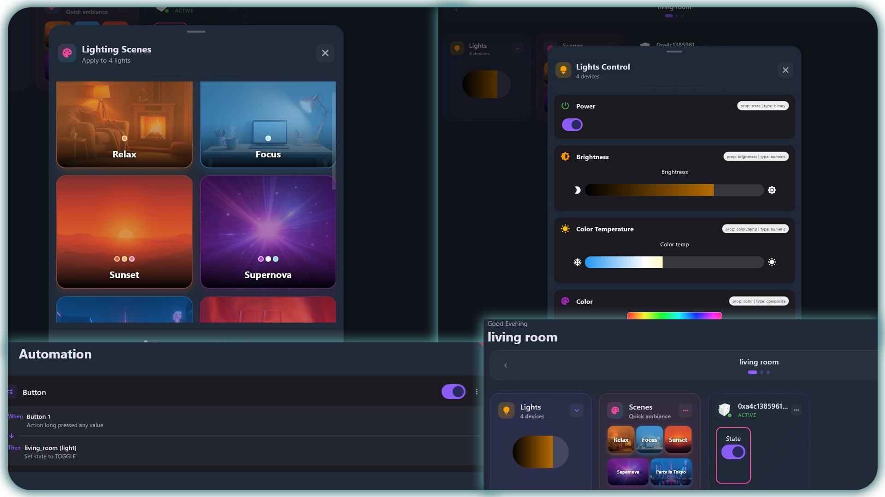

<p align="center">
   
</p>

<p align="center">
   
</p>

# Sumika - Smart Home Management Platform

Sumika is a self-hosted comprehensive smart home management platform developed by [Beyond Cloud](https://cosmos-cloud.io).

It is an alternative to Home Assistant with a different philosophy. Where HA focuses on maximum flexibility and customization, and supporting absolutely every device under the sun, Sumika aims to provide a more curated and user-friendly experience out of the box. It makes some assumptions, and tries to cover the most likely scenarios for users. It means that while HA expects you to spend X amount of time configuring it to your current smart home setup, with Sumika, you can get started quickly with minimal setup, but on the other hand you might have to invest into hardware that Sumika actually supports.

As of now Sumika strictly only supports Zigbee devices, thanks to integrating into the awesome Zigbee2MQTT project. You can check their site for the list of supported devices, it is quite large.

## 🔨 What about new integrations?

Sumika will add support for additional protocols beside Zigbee in the future. Such as Wifi or Bluetooth devices and so on. One important philosophy decision is to only support devices that can work 100% locally offline. Unlike HA, Sumika's direction is to not rely on cloud services for any device. This will make it easier for users to plan their setup with confidence, as opposed to seeing an integration and realising later that it requires a cloud account even in a self-hosted HA. This is for maximum security  and privacy, but also to ensure that an integration / hardware is not made obselete by a disappearing cloud service. 

## 🏠 What is Sumika?

Sumika transforms your smart home devices into an integrated, easy-to-use automation platform. It manages your smart lights, switches, sensors, and other IoT devices, providing:

- **Device Management**: Discover, control, and organize all your devices
- **Dashboard**: Automatic dashboard populated with your rooms and devices for a smooth experience
- **Zone-Based Organization**: Group devices by rooms or areas for easier management
- **Real-Time Control**: Instant device state updates via WebSocket connections
- **Automation Engine**: Create IFTTT-style automations and scene triggers
- **Scene Management**: Lighting scenes for different moods and activities
- **Cross-Platform**: Works on web browsers, Android, iOS, Windows, macOS, and Linux with native apps

## 🚀 Quick Start

### Prerequisites
- Docker
- Zigbee coordinator device (USB dongle)
- Compatible Zigbee smart home devices

### Installation

[TODO]

### First-Time Setup

1. **Configure Zigbee2MQTT**: Use the Zigbee2MQTT web interface to pair your devices
2. **Open Sumika**: Navigate to the Sumika web interface or mobile app
3. **Create Zones**: Organize your devices into rooms or functional areas
4. **Set Up Automations**: Create rules for device interactions
5. **Configure Scenes**: Set up lighting scenes for different activities

## 🔧 Configuration

### Environment Variables

You can use an external MQTT broker, but it is not required as Sumika has its own embeded MQTT.

- `EXTERNAL_MQTT_BROKER`: Use external MQTT broker (optional)
- `EXTERNAL_MQTT_USERNAME`: MQTT broker username (if required)
- `EXTERNAL_MQTT_PASSWORD`: MQTT broker password (if required)

## 🔮 Future Features

### Planned Features
- Advanced automation conditions
- Multiple actions per automation
- Dashboard optimization improvements

### Future Considerations
- Camera support integration
- User management and roles
- Bluetooth device support
- Enhanced Android/iOS mobile features
- Screen-based lighting controls
- HA integration

## 🤝 Contributing

Sumika is open source and welcomes contributions! Areas where help is needed:

- **Device Support**: Testing with different Zigbee devices
- **UI/UX Improvements**: Enhanced user interface designs
- **Platform Support**: Additional platform integrations
- **Documentation**: Improved setup guides and tutorials
- **Bug Fixes**: Issue resolution and stability improvements

## 📄 License

This project is licensed under the MIT License - see the LICENSE file for details.

## 🔗 Related Projects

- **Zigbee2MQTT**: [https://www.zigbee2mqtt.io/](https://www.zigbee2mqtt.io/)
- **Flutter**: [https://flutter.dev/](https://flutter.dev/)
- **Go**: [https://golang.org/](https://golang.org/)

## 🛠️ Development

For development, you can use the provided Docker Compose file to set up your environment quickly. Make sure to have Docker and Docker Compose installed on your machine.

```bash
docker-compose -f docker-compose.dev.yml up --build
```

This command will start the development server and all necessary services. You can then access the web interface at `http://localhost:8081`.


```bash
cd client
flutter run -d [device]
```

